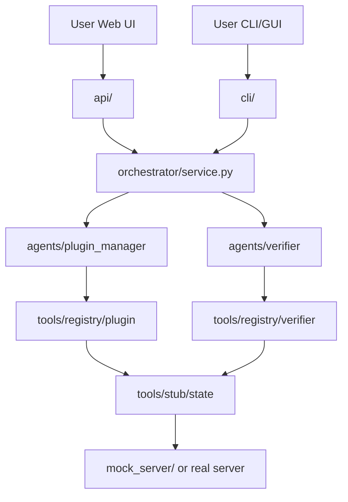

# Architecture

This project uses the **Python src layout** — the pattern recommended by [PyPA](https://packaging.python.org/en/latest/discussions/src-layout-vs-flat-layout/) for applications and libraries.

## Directory map

```
minecraft-server/
├── pyproject.toml          # dependencies, scripts, package metadata
├── README.md
├── MEMORY.md               # project memory for AI / future you
├── main.py / gui.py        # thin shims (backward compatible)
├── web/                    # React + Vite + TypeScript + Tailwind demo UI
├── src/
│   └── mcserver/           # ← all application code lives here
│       ├── config.py       # env vars, paths, plugin catalog settings
│       ├── models.py       # ChangeRecord, VerifyResult, etc.
│       ├── agents/         # LLM layer (prompts + tool-calling loop)
│       ├── orchestrator/   # deterministic workflow (plain Python)
│       ├── api/            # FastAPI HTTP bridge (SSE logs, server/plugins)
│       ├── tools/
│       │   ├── registry/   # JSON schemas + name→function maps
│       │   ├── process/    # real Java start/stop/restart
│       │   ├── plugins/    # Hangar / Modrinth / Spigot search + download
│       │   ├── stub/       # mock plugin FS + delegates process when jar exists
│       │   └── catalog.py  # static tool list fallback
│       └── cli/            # user-facing entrypoints (terminal, GUI, logging)
├── tests/
├── mock_server/            # runtime stub data (gitignored)
└── logs/                   # per-run logs (gitignored)
```

## Why this structure is good

### 1. **src layout** — industry standard for Python apps

| Benefit | What it means for you |
|---------|----------------------|
| Clean imports | `from mcserver.agents import PluginManagerAgent` — always explicit |
| No accidental imports | Running from repo root won't pick up random `.py` files |
| Installable package | `uv sync` installs `mcserver`; scripts work from anywhere |
| Scales to PyPI / Docker | Same layout whether it's a hobby repo or production service |

### 2. **Layered by responsibility** — easy to find things

| Layer | Folder | Role |
|-------|--------|------|
| **Entry** | `cli/`, `api/`, `web/` | How users start the app (terminal, Tkinter, HTTP + React) |
| **Workflow** | `orchestrator/` | Fixed pipeline: route → verify → rollback |
| **Intelligence** | `agents/` | LLM prompts and tool-calling loops |
| **Actions** | `tools/` | What actually touches the server (stub or real) |
| **Contracts** | `models.py` | Data passed between layers |

When you add real RCON, you only change `tools/stub/` → `tools/rcon/` without touching agents or CLI.

### 3. **Registry vs implementation split** — MCP-ready later

```
tools/registry/plugin.py   → schemas the LLM sees
tools/stub/state.py        → Python functions that run today
```

The agent only knows the registry. Swap `stub` for `rcon` or wrap the same functions in an MCP server — agent contracts stay the same.

### 4. **tests/ at repo root** — standard pytest location

Tests import the installed package (`from mcserver...`), same as production code. No path hacks.

### 5. **Runtime data separated from code**

| Path | Purpose |
|------|---------|
| `mock_server/` | Fake server state while developing |
| `logs/` | Session logs from GUI/CLI/API |
| `.env` | Secrets (never committed) |

Code in `src/`; generated/local data outside it.

### 6. **Web UI** — React SPA over FastAPI

The browser never talks to agents directly. `web/` calls `api/`; `api/` calls `Orchestrator`. The orchestrator stays deterministic Python (no LLM router in the UI layer).

| Endpoint | Role |
|----------|------|
| `POST /api/requests` | Start an orchestrator run |
| `GET /api/requests/{id}/events` | SSE log stream + final result |
| `GET /api/server/status` | Process alive / pid |
| `POST /api/server/{start\|stop\|restart}` | Process controls |
| `GET /api/plugins` | Allowed sources + blocklist + loaded + jars |

## Layer flow



## What we deliberately did NOT use (yet)

| Framework | Why skipped for now |
|-----------|---------------------|
| FastMCP | Tools are in-process; add MCP wrapper later if OpenClaw/Cursor need the same tools |
| LangGraph | Orchestrator is simple; add when retries/human-approval grow |
| CrewAI / AutoGen | Would push LLM routing; we want plain-code orchestrator |
| Next.js | Local admin tool; Vite SPA is enough until a marketing site is needed |
| Electron | Prefer web first; optional Tauri shell later |

## Adding a new feature (cheat sheet)

| Task | Where to edit |
|------|---------------|
| New plugin tool | `tools/registry/plugin.py` + `tools/stub/state.py` + `tools/plugins/` |
| New verify check | `tools/registry/verifier.py` + stub implementation |
| Change workflow | `orchestrator/service.py` |
| Change agent behavior | `agents/plugin_manager.py` or `agents/verifier.py` |
| New CLI flag | `cli/main.py` |
| New HTTP route | `api/app.py` |
| Web UI page | `web/src/pages/` |
| Config / plugin policy | `config.py` (`PLUGIN_BLOCKLIST`, `PLUGIN_ALLOWED_SOURCES`) |
